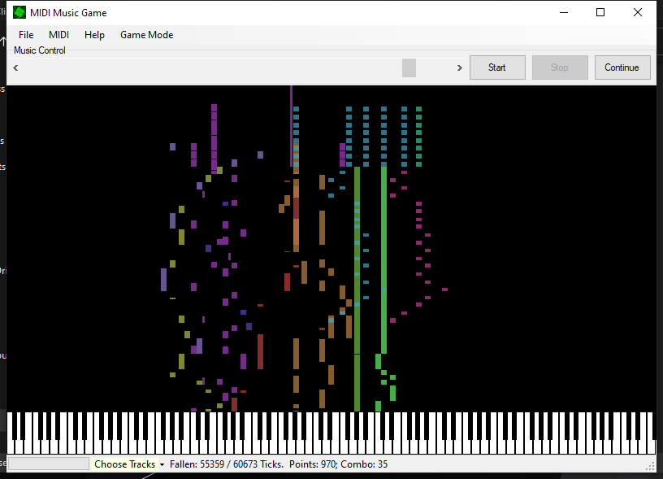

# MidiMusicGame
An Embryonic Music Game that also works as a Midi player.

As you can see, many functions on the menu are not implemented (because I lost interest half-way).

To play it, first click the File and then Open and choose a Midi file, maybe town.mid or flourish.mid, whaesoever.

The Choose Tracks at the bottom does work. You can separate different tracks of the Midi file and only play the tracks you want (or not).

You can drag the horizontal scroll bar when playing at any time since it serves as a trackbar (did not bother writing a nice-looking trackbar GUI).

Oh, almost forgot. Use your keyboard to play the piano.

## Image
